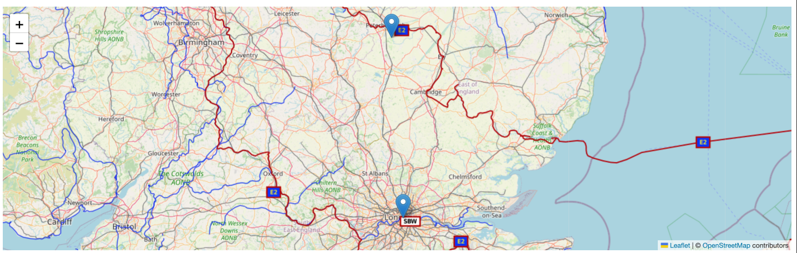

# Angular Leaflet Map

Proyecto creado con [Angular CLI](https://github.com/angular/angular-cli) version 13.0.2. para desarrollo de aplicaciones Angular con información que muestra mapas para diferentes propósitos.

##### Creador:
* [Anartz Mugika Ledo](https://anartz-mugika.com/)

#### Guía de como trabajar con la librería

[En este enlace](https://mugan86.github.io/ng-leaflet/es/readme) encontramos lo necesario para trabajar con la librería. Actualmente no está al 100% documentado, pero iremos poco a poco actualizando con nuevo contenido.

##### Recomendaciones:
1. Tener instalado NodeJS versión LTS >= 14.
2. Tener instalado Yarn, para poder gestionar las dependencias en vez de usar NPM
3. Leer las guías para contribuir, participar y colaborar tanto en el desarrollo como en el apartado de traducciones.
4. Si se hacen sugerencias, se agradecería que se hiciese desde el apartado "issues" con el título "[Suggest - Propuesta] Descriptive title / Título descriptivo." Se aceptan las sugerencias tanto en Español e Inglés siempre y cuando se detalle bien lo propuesto con algún enlace a un ejemplo en Google Maps u otras librerías o una imagen con un wireframe.

Antes de empezar con las cosas a tener en cuenta en el proyecto, podemos encontrar algunos enlaces muy interesantes relacionados con la librería:

* [Documentación oficial de la librería](https://mugan86.github.io/ng-leaflet/)
* [Ejemplos con las demos con las diferentes variantes](./DEMO.md)
* [Leaflet - Página oficial](https://leafletjs.com/)
* [Curso GRATIS para aprender a trabajar con Leaflet en Typescript](https://www.youtube.com/playlist?list=PLaaTcPGicjqgLAUhR_grKBGCXbyKaP7qR)
* [Inspiración con proyectos realizados](https://tomik23.github.io/leaflet-examples/)

## Estado del proyecto en las tareas

En este apartado, [podremos visualizar las tarjetas con las funcionalidades planeadas](https://github.com/mugan86/ng-leaflet/projects/1), las que está en desarrollo y las que ya están implementadas en producción.

El propósito es que observéis las que están disponibles, seleccionéis una de ellas, abráis una incidencia de **issue** para empezar a trabajar con esa funcionalidad.

## Contribuir en el proyecto

Para poder contribuir en el proyecto os animamos a que leáis [esta guía de contribución](CONTRIBUTING.md) (que está en desarrollo) para seguir los pasos correctamente y poder aportar vuestro granito de arena.

## Hacer petición para integrar nuevas funcionalidades
Una vez terminada la funcionalidad, debemos de realizar un pull request lo más detallado posible con los casos de uso (capturas serían bienvenidas), se revisará por varias personas y si todo está ok, se aceptará. En el caso de que no sea satisfactorio, se dará un feedback detallado con lo que falta / no es correcto.

## Build

Run `ng build` to build the project. The build artifacts will be stored in the `dist/` directory.

## Running unit tests

Run `ng test` to execute the unit tests via [Karma](https://karma-runner.github.io).

## Running end-to-end tests

Run `ng e2e` to execute the end-to-end tests via a platform of your choice. To use this command, you need to first add a package that implements end-to-end testing capabilities.

## Further help

To get more help on the Angular CLI use `ng help` or go check out the [Angular CLI Overview and Command Reference](https://angular.io/cli) page.

## Example

En construcción la información complementaria y traducción al inglés

